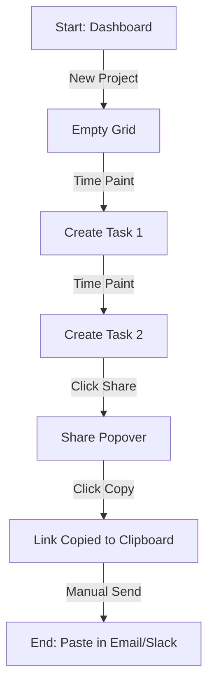
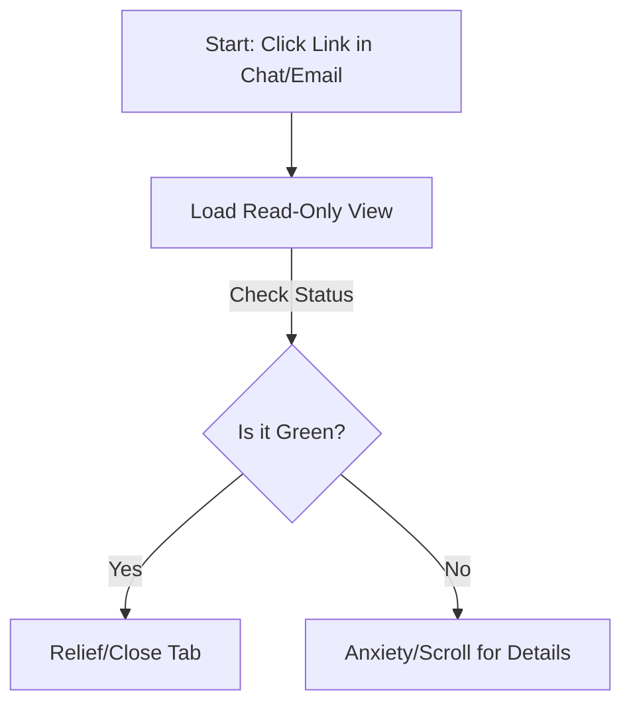
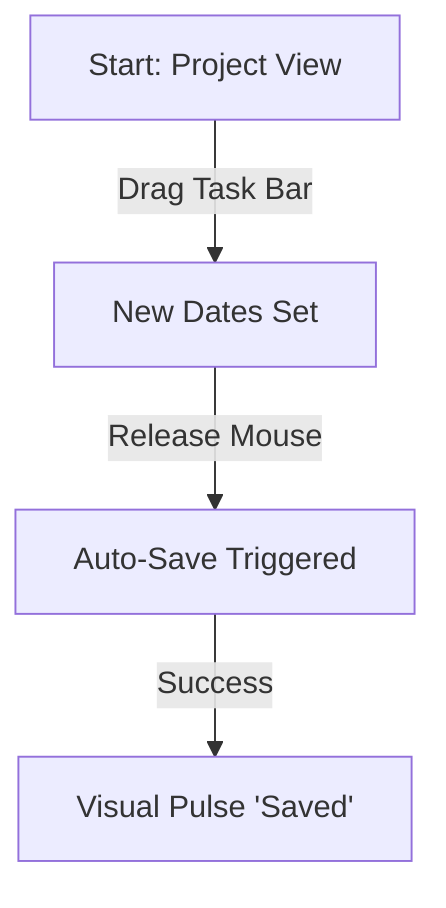

# UX Design Specification - bmad_project

**Author:** Admin
**Date:** 2026-01-17

---

<!-- UX design content will be appended sequentially through collaborative workflow steps -->

## Executive Summary

### Project Vision
The "Anti-Jira" for client communication. A minimalist, "Client Broadcaster" timeline tool that bridges the gap between internal project management and external client reassurance. Prioritizes speed of creation and zero-friction sharing over granular task tracking.

### Target Users
*   **Project Lead (Admin):** Busy freelancers/leads who need to create timelines in < 2 minutes and avoid "status update" emails. Values autonomy and speed.
*   **Client (Viewer):** Anxious stakeholders who want instant reassurance ("Where are we?") without logging into complex tools. Values simplicity and speed.
*   **The "Trust" Interface:** The public view must look authoritative and "live" instantly to prevent the client from emailing to confirm "is this accurate?".

### Design Opportunities
*   **Micro-Interactions for Trust:** Use subtle animations (e.g., "Live Updating" pulse) to signal that the data is fresh.
*   **"Glanceability":** Design the public view so status can be absorbed in < 3 seconds.

## Core User Experience

### Defining Experience
The "Heartbeat" of the product is the **Live Sync Loop**:
1.  **Action:** Admin drags a task bar on Desktop.
2.  **Reaction:** System auto-saves silently.
3.  **Result:** Client's view updates instantly (via WebSocket/Poll) with a visual pulse.

### Platform Strategy
*   **Admin Console:** Optimized for **Desktop/Mouse**. Precision pointing required for timeline adjustments.
*   **Public View:** Optimized for **Desktop Browsing**. Large, horizontally spanning timeline views for maximum context.

### Effortless Interactions
*   **Implicit Editing:** No "Edit Mode" toggle. Dragging *is* editing.
*   **Implicit Saving:** No "Save" button. State is persisted immediately on drop.
*   **Zero-Login Access:** Clients click a link and are *there*. No interstitial screens.

### Critical Success Moments
*   **The "Heavy Drop":** Task bars must feel substantial and snap reliably to grid dates. Loose/jittery dragging destroys trust.
*   **The "Trust Pulse":** When data changes while a client is watching, the UI must subtly flash (e.g., green highlight) to signal "This is live."

### Experience Principles
1.  **Precision for Admins:** Give the lead confident control over the schedule.
2.  **Zero-Friction for Clients:** Remove every barrier between the email link and the data.
3.  **Trust through Speed:** Speed of load and update is the primary proxy for data accuracy.

## Desired Emotional Response

### Primary Emotional Goals
*   **For Clients:** **Calm Assurance.** "I see the plan. It’s on track. I can relax."
*   **For Admins:** **Confident Control.** "I own this schedule. I can update it in seconds."

### Emotional Journey Mapping
1.  **Discovery (Link Receipt):** Skepticism ("Another link?") -> **Relief** ("Oh, it's just the timeline. No login needed.").
2.  **Usage (Viewing):** Anxiety ("Is it late?") -> **Clarity** ("Blue bar means in progress. Green means done.").
3.  **Return:** Habit ("I'll just check the link.") -> **Trust** ("It's always up to date.").

### Micro-Emotions
*   **Freshness:** The UI must feel "Live" (like a stock ticker), not static (like a PDF).
*   **Safety:** The Admin interface must clearly distinguish "Editing" from "Published" (though in our MVP, they are same state, so "Auto-Saving" feedback is the safety signal).

### Design Implications
*   **Calm Colors:** Use status colors that are distinct but not alarming (e.g., avoid "Warning Red" for simple delays; use Neutral Greys/Blues).
*   **Clean Typography:** High-legibility fonts (Inter/San Francisco) to convey authority.
*   **Status Badges:** Explicit "Last Updated" timestamps to kill uncertainty.

### Emotional Design Principles
1.  **Don't Make Me Think:** If the client has to guess what a bar means, we failed.
2.  **Don't Make Me Wait:** Speed = Trust.
3.  **Don't Make Me Login:** Access = Relief.

## UX Pattern Analysis & Inspiration

### Inspiring Products Analysis
*   **Toggl Plan (Primary):** The gold standard for visual project planning.
    *   *Why:* It treats time as the primary dimension. Project management *is* timeline management.
    *   *Key Feature:* "Swimlanes" where you can see multiple streams of work in one view without scrolling vertically forever.
*   **Linear (Secondary):** For interaction speed and keyboard-first ethos.
*   **Notion (Secondary):** For minimalist typography and "content-first" UI.

### Transferable UX Patterns
*   **The "Paint" Action (Toggl Plan):** To create a task, you don't click a button; you click-and-drag across the dates you want.
*   **Color-Coded Segments:** Using bright, distinct colors for tasks against a pale background (high contrast for "glanceability").
*   **Optimistic Updates (Linear):** visual changes happen instantly, network syncs in background.

### Anti-Patterns to Avoid
*   **The "Gantt Knot" (Traditional PM Tools):** Overloading the view with dependency arrows, critical path lines, and % complete shading. Keep it clean.
*   **Hidden Dates:** Forcing users to click a task to see its start/end date. They should be visible or inferable from the grid always.

### Design Inspiration Strategy
**Strategy:** "Toggl's Visuals + Linear's Engine."
We will adopt Toggl Plan's visual hierarchy (Tasks on Grid) but implement it with the ruthlessness of a read-only broadcaster.

## Design System Foundation

### Design System Choice
**Shadcn/UI + Tailwind CSS.**
*   **Foundation:** Radix UI primitives (headless, accessible).
*   **Styling:** Tailwind CSS utility classes.
*   **Distribution:** Copy-paste components (owned code), not an npm dependency hell.

### Rationale for Selection
*   **Speed-to-Value:** Instant access to high-quality, accessible components (Dialogs, Popovers, Calendars).
*   **"Anti-Jira" Aesthetic:** The default "New York" style in Shadcn is clean, monochromatic, and professional—ideal for our "Calm Assurance" goal.
*   **Developer Experience:** Fits perfectly with the Modern React stack.

### Implementation Approach
1.  **Init:** `npx shadcn-ui@latest init` within the `app` directory.
2.  **Components:** Install only what we need (Card, Button, Input, Slider/Progress).
3.  **Typography:** Enforce `Inter` or `Geist Sans` for that crisp, modern look.

### Customization Strategy
*   **Palette:** `Zinc` or `Slate` (Neutral). Avoid high-saturation primary colors except for "Status" indicators.
*   **Radius:** `0.5rem` (Subtle rounding).
*   **Animation:** Use `framer-motion` for the timeline dragging, but standard CSS transitions for UI elements.

## 2. Core User Experience

### 2.1 Defining Experience
**"Time Painting."** The user creates a plan by *drawing* it on the timeline, rather than filling out forms. This shifts the paradigm from "Data Entry" to "Direct Manipulation."

### 2.2 User Mental Model
*   **Analogy:** "It's like blocking out time on my Google Calendar, but for project phases."
*   **Expectation:** I click where I want it to start, and drag to where I want it to end. The system figures out the dates.

### 2.3 Success Criteria
*   **Latency:** Zero-latency feedback. The ghost bar must appear on the *exact* frame of the mouse down.
*   **Snap-to-Grid:** The bar must magnetic-snap to column boundaries (Days/Weeks) so it never looks messy.
*   **Post-Interaction:** Immediately after dropping, the keyboard focus should be on the "Task Title" input so I can type "Design Phase" [Enter] without clicking again.

### 2.4 Novel UX Patterns
*   **Adopted Pattern:** "Calendar Drag-Create" (Google Calendar).
*   **Innovation:** Applying this to a Gantt view (Project Row) makes project management feel as lightweight as scheduling a meeting.

### 2.5 Experience Mechanics
1.  **Initiation:** User hovers cursor over an empty grid cell. Cursor changes to "Crosshair" or "Pencil". User triggers `MouseDown`.
2.  **Interaction:** User drags cursor right. A semi-transparent "Ghost Bar" renders from Start Date to Current Cursor Date. A tooltip displays "Oct 12 - Oct 20 (9 Days)".
3.  **Completion:** User triggers `MouseUp`.
    *   Ghost bar becomes solid.
    *   A minimalist Popover appears attached to the bar.
    *   Input field is auto-focused.
4.  **Refinement:** User types "Discovery", hits [Enter]. Popover closes. Data saved.

## Visual Design Foundation

### Color System
*   **Neutrals:** `Slate` or `Zinc` (Tailwind defaults). Used for 90% of the UI (Backgrounds, text, borders).
*   **Accents (Tasks):** Distinct, high-contrast pastels for timeline bars (e.g., `bg-blue-500`, `bg-purple-500`, `bg-pink-500`) to stand out against the neutral grid.
*   **Status Indicators:** Standard semantic colors (Green=Done, Amber=Blocked, Gray=Todo) but desaturated to avoid "alert fatigue."

### Typography System
*   **Font:** **Inter** (via `next/font`).
*   **Scale:** Simple hierarchy.
    *   `text-lg font-semibold` (Project Titles)
    *   `text-sm font-medium` (Task Titles)
    *   `text-xs text-muted-foreground` (Dates/Meta)

### Spacing & Layout Foundation
*   **Density:** **Compact.** Grid rows should be short (e.g., `h-10`) to fit more project context on screen.
*   **Whitespace:** Minimal horizontal padding. The timeline is an "Infinite Canvas" concept, so maximizing horizontal space is key.
*   **Radius:** `rounded-md` (0.5rem).

### Accessibility Considerations
*   **Contrast:** Ensure Task Bar colors have sufficient contrast against the grid background.
*   **Target Size:** Even with dense layout, touch targets (invisible hitboxes) for dragging must meet 44px minimum on mobile.

## Design Direction Decision

### Design Directions Explored
We explored two primary layout structures:
1.  **Sidebar Navigation:** Traditional SaaS layout. Good for navigation depth, but eats 250px of horizontal timeline space.
2.  **Topbar Navigation:** Maximizes the "Infinite Canvas." Pushes chrome to the edges.

And two density options:
*   **Compact (`h-10`):** High data density.
*   **Comfortable (`h-16`):** Touch-optimized.

### Chosen Direction
**Layout B (Topbar) + Compact Density.**

### Design Rationale
*   **Maximize Timeline:** The Timeline is the product. A Topbar layout allows the grid to span 100% of the viewport width, allowing users to see ~2 more weeks of time without scrolling.
*   **Professional Feel:** The Compact density appeals to the "Power Admin" persona who wants to see the whole picture, matching the efficiency of the spreadsheets we are replacing.

### Implementation Approach
*   **Shell:** A persistent `h-14` topbar containing the Brand, View Switcher (Projects/Team), and User Profile.
*   **Canvas:** The rest of the screen (`flex-1`) is dedicated entirely to the Scrollable Grid.
*   **Responsive:** On Mobile (< 1024px), the app displays a "Desktop View Required" notice.

## User Journey Flows

### Journey 1: The 5-Minute Setup (Admin)
**Goal:** Create a timeline and get a link to the client in under 5 minutes.

### Journey 2: The Friday Panic (Client)
**Goal:** Confirm project status immediately via mobile.

### Journey 3: The Scope Change (Admin)
**Goal:** Update timeline without friction.

### Journey Patterns
*   **The "Share" Pattern:** Persistent "Share" button in Topbar -> Popover -> Copy.
*   **The "Edit" Pattern:** Direct manipulation (Drag) -> Auto-save -> Subtle Notification.

## Component Strategy

### Design System Components (Shadcn/Primitive)
These handle the "Chrome" (Navigation, Forms, settings).
*   **Install List:** `Button`, `Input`, `Popover`, `Calendar`, `Badge`, `Avatar`, `Tooltip`, `Dialog`.
*   **Usage:** Used strictly for non-timeline interactions (Login, Project Settings, Share Dialog).

### Custom Components (The "Engine")
These handle the "Canvas" (The Timeline).
*   **`TimelineGrid`:** A virtualized container handling extensive horizontal/vertical scrolling.
    *   *Props:* `startDate`, `endDate`, `density`.
*   **`TaskBar`:** The interactive "pill" representing a task.
    *   *States:* `Idle`, `Hover` (shows handles), `Dragging` (opacity 80%), `Selected` (thick border).
    *   *Gestures:* Drag-x (Move), Drag-edge (Resize).

### Component Implementation Strategy
1.  **Phase 1: The Grid:** Build the static grid with CSS Grid/Flexbox.
2.  **Phase 2: The Data:** Render read-only `TaskBars` on the grid properly positioned by date.
3.  **Phase 3: The Interaction:** Implement `dnd-kit` for the Drag/Resize logic.

### Implementation Roadmap
*   **Week 1:** Initialize Shadcn + Build `TimelineGrid` (Read-Only).
*   **Week 2:** Implement "Time Painting" (Create Task) + `TaskPopover`.
*   **Week 3:** Refine Share Logic + Polish.

## UX Consistency Patterns

### Task Interaction Pattern (The "No Modal" Rule)
*   **Behavior:** Clicking a task opens a `Popover` rooted to the task element.
*   **Context:** The user never loses visual context of the timeline. The grid remains visible behind the popover.
*   **Action:** Click outside the popover to Close & Auto-Save.

### Feedback Pattern (The "Optimistic" Rule)
*   **Trigger:** Drag-and-drop or Text Edit.
*   **Immediate Response:** The UI updates instantly. The state is treated as "True" immediately.
*   **Async Sync:** The save request happens in the background.
*   **Success Indicator:** A small, non-intrusive "Saved" label in the Topbar (Linear style). No blocking spinners.

### Sharing Pattern (The "Manual Control" Rule)
*   **Philosophy:** The system produces artifacts (links), but humans control distribution.
*   **Component:** `LinkCopy` component. A read-only input with a "Copy" button.
*   **Feedback:** "Copied to Clipboard" toast on click.

### Navigation Pattern (The "Infinite Scroll" Rule)
*   **Date Traversal:** Horizontal scroll (Shift+Wheel or Touchpad Pan) moves time.
*   **Date Jump:** A "Today" button always returns the view to the current date.

## Responsive Design & Accessibility

### Responsive Strategy
*   **Scope:** **Desktop Only (MVP).**
*   **Rationale:** Complex timeline management requires precision mouse control and screen real estate.
*   **Mobile Handling:** Users on screens < 768px will see a "Please view on Desktop" placeholder. No vertical timeline implementation for now.

### Accessibility Strategy (Keyboard First)
Since we are building a "Pro Tool," keyboard efficiency is the accessibility priority.
*   **Navigation:** `Arrow Keys` to traverse the grid.
*   **Shortcuts:**
    *   `Enter`: Edit Key Task
    *   `Del`: Delete Task
    *   `Esc`: Cancel/Close Popover
    *   `Shift + Drag`: Clone Task

### Implementation Guidelines
*   **Minimum Width:** The app container will have a `min-width: 1024px`.
*   **Touch Targets:** We can be denser (relaxed touch targets) since we are assuming Mouse/Trackpad usage.
